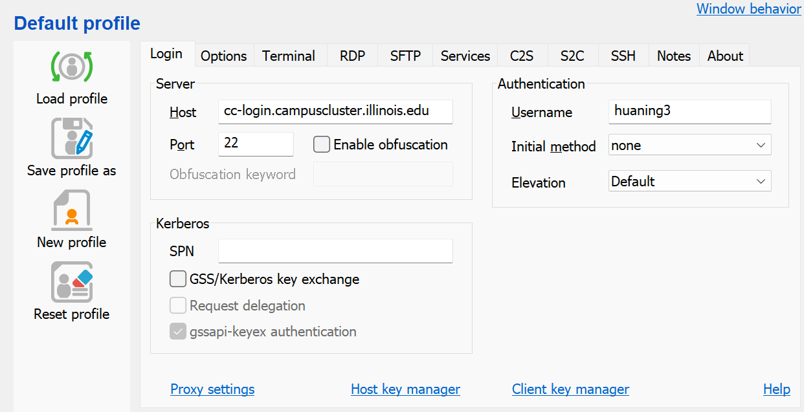

# UIUC Campus Cluster Instruction
1. To begin with, you will need to apply the access of central cluster via the link: https://campuscluster.illinois.edu/new_forms/user_form.php. Select the __primary queue__ as __STAT__ - it seems Prof. Ruoqing Zhu is the manager and you'll get notice of approval via his email soon.
2. Preparatory: The software combo I chose is Ubuntu Windows (Linux-based) for submitting jobs, and Bitverse SSH Client for uploading folders/files to the cloud.
3. Log onto the cloud via Bitverse SSH Client first, upload all files you want to run together with `req.yml` to the cluster. 
4. Job submission
   - In Ubuntu, run command `ssh -X -l <username> cc-login.campuscluster.illinois.edu` to log into the cluster, password is needed then.
   - At this time, you'll see that neither `conda` nor `python` works, so we'll need to first "import" conda, then create an conda environment that adapts our codes.
     (1). run `module load anaconda/3` to acitvate anaconda
     (2). run `conda create --name <environment name> --file req.yml` to create a conda environment, this may take a while to run. And note that this is one-time operation: after you created the environment, you could skip this step for further loggin's.
     (3). run `source activate <environment name>` to activate the environment
   - It's time to use slurm to submit the file to the cluster. `cd` into the path that contains the `job.slurm` file first, then run `sbatch job.slurm`. To edit the file, one could simply do `vim job.slurm`, type `i` to enter insert mode, then edit it as he/she wished. After finished, press `:wq`+`enter` to exit the vim.
   - A successful job submission outputs `Submitted batch job 10671608`. To moniter the job, one could do `scontrol show job 10671608`. Note the number here is just an example. But unfortunately, `squeue -u <username>` wouldn't work for now since we are yet to have an account of the cluster.

Reference: https://docs.ncsa.illinois.edu/systems/icc/en/latest/getting_started.html
